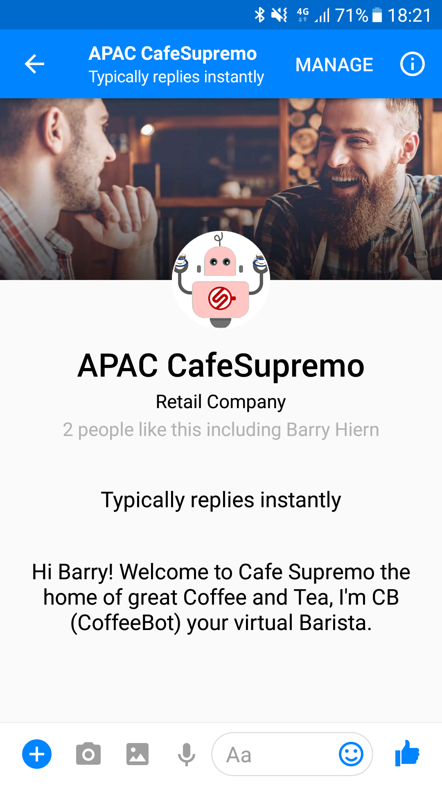
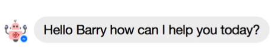
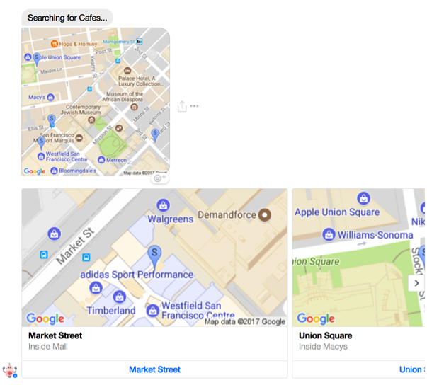
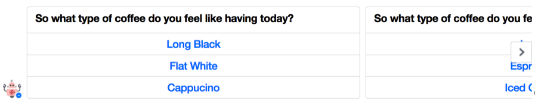
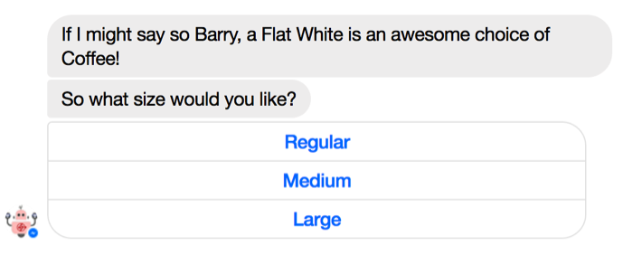
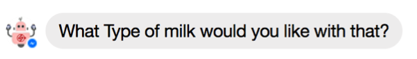
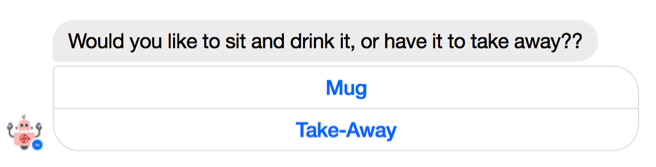
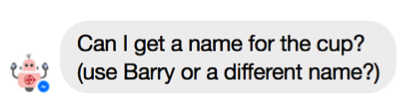
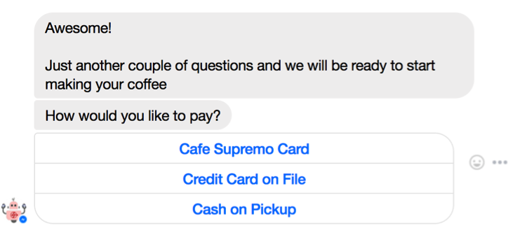

# ORACLE Cloud Test Drive #

## Lab 1: Hands On CafeSupremo Bot ##

**Order a Coffee with the Café Supremo Coffee Bot. Your instructor will give you details on accessing the bot.**

**NOTE:** To access the Bot you will need to have your Facebook user registered as a Tester within the Facebook App.  Please make sure you have given this to the instructor.

To find your Facebook ID (as opposed to your Login Name), login to your facebook account and click on your Avatar | name in the page header - this will take you to your profile page.

Your Facebook ID is indicated in the URL of the page ``https://www.facebook.com/{your facebook ID}``

# Lab Exercise: #

1. Open the Messenger App on your Mobile device. select the "hamburger" menu and select Scan Message Code
**NOTE:** The following if from the Android version of the Facebook Messenger App.  The iOS screens may differ!

2. Scan the Messenger QR code given to you by your Instructor.

Which will open the Cafe Supremo Coffee Bot.

3. Try out the following interaction scenarios with the Bot. (Your input, followed by example responses by the Bot.)

### A Brand New Customer with all Questions ###

- **Hello Coffeebot!**

- **I really need a strong coffee!** 

- **Select “Yes” or type something like “Yes Please”**

- **Using the Carousel, choose a café location** ``(e.g. Market Street or Union Square)`` **or Type in the name of the Café location** ``(e.g. Howard Street)``

- **Choose any of the Coffee Types or type in other options**  ``(e.g. “kopiO”,”Americano”)``

- **Coffee shops frequently have different names for their sizes.  Rather than choosing from the list try typing a “Named size”** ``(e.g. “venti”,”tall”,”grande”)``

- **Type in a type of Milk : Try an an invalid Type to test the Bot ``(eg. "Fermented Yak")`` followed by a common type of Milk ``(eg. “soy”, ”skimmed”, ”regular”, ”full cream” etc.)``

**NOTE: :  If you chose a Black coffee then type something like.** ``“I said a black coffee so no Milk!” or “None”``

- **Choose from the list, or Type** ``“A Cup is fine”``**, or** ``“I’ll take away”``

- **Write your own name or something else.**

- **Select a payment method**

- **Choose a time period from the list or enter something like** ``“in about 10 minutes”``

- **No**

- **click the** ``[Go]`` **button, it will take you to a registration Form.**  

In this case simply click the** ``[Submit and Close]`` **button to return to the Bot Conversation**.

- **Thank you Bot for your help!**

### A Repeat Customer with information from the CRM system ###
- **Hello Coffeebot!**

- **I want a coffee!** 

- **No**

- **Howard Street**

- **Yes**

**NOTE:** The Conversation continues the same as Scenario 1,  however all questions that relate to the previous Order are skipped….

### The Customer gives sufficient information in their initial request ###
Rather than have the CoffeeBot ask a lot of questions as in Scenario #1, you can give various levels of information in the initial request/statement and the bot will avoid asking redundant questions.  (Try different versions of the initial request after the hello)

- **I want a large double shot soy latte to take away. I'll do a cash pick up at the Union Square cafe in about 10 Minutes**

- **Write your name.**

- **No**
- **Thanks for the help!**

# End of Lab 1: #

<< [Back to Intelligent Bot Test Drive Home](README.md)
