# ORACLE Cloud Test Drive #

## Lab 1: Hands On CafeSupremo Digital Assistant ##

### Introduction ###
The CafeSupremo Digital Assistant is designed to attract new customers and to allow current customers to have a more personal interaction with the brand.  In this instance a prospective customer (Lucy) is walking down the street and has a desire for a cup of coffee.
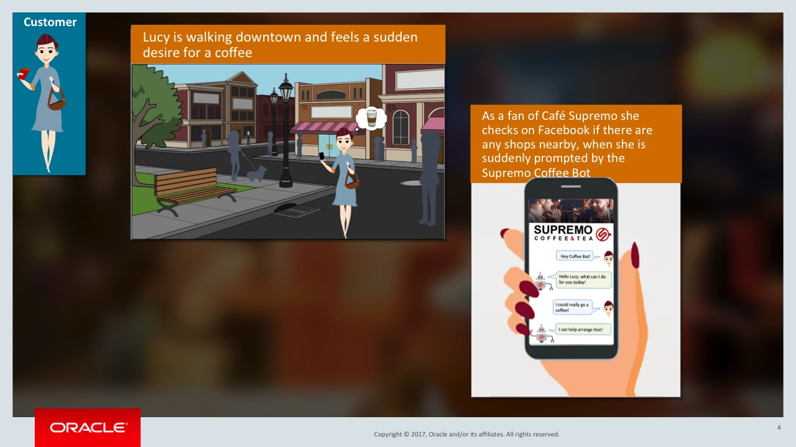

By simply searching for the Café Supremo web page in her mobile browser (this Lab), or using a social channel, such as [Facebook Messenger](500.md), Lucy is able to access their "Virtual Barista" and quickly order the beverage she is after, and have it ready by the time she reaches the nearest Coffee Shop.

In this Lab, you will be accessing the bot to similarly order a coffee from CafeSupremo; Firstly as a prospective/new customer, then subsequently acting as a repeat and/or more knowledgeable customer of the brand.

You will see how the bot is able to interact with you as a customer, then as it learns from your past orders, how it can tailor the questions to optimise the interaction.

### Order a Coffee with the Café Supremo Coffee Bot.###

# Lab Exercise #

1. While the Cafe Supremo Web-Site utilises responsive design and hence is viable for a mobile browser, for this lab you will be accessing the  in your desktop browser

Open the Cafe Supremo Website via the following link

[https://cafesupremowebchat-pmomceapac.aucom-east-1.oraclecloud.com](https://cafesupremowebchat-pmomceapac.aucom-east-1.oraclecloud.com)

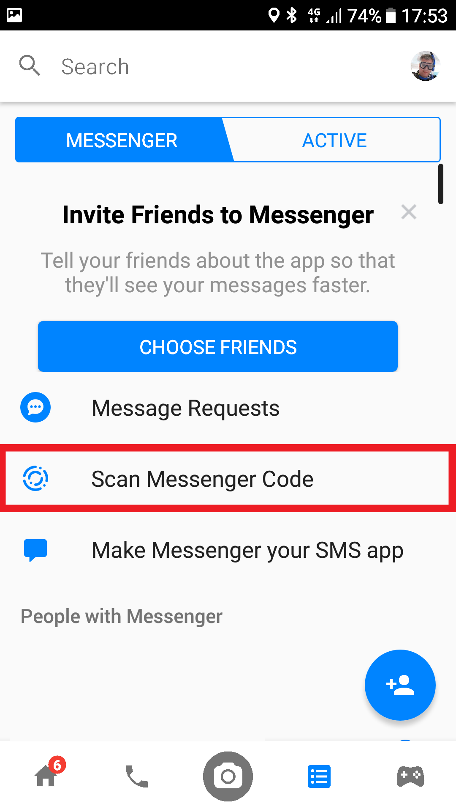

2. Click the Digital Assitant Avatar at the bottom right of your screen.

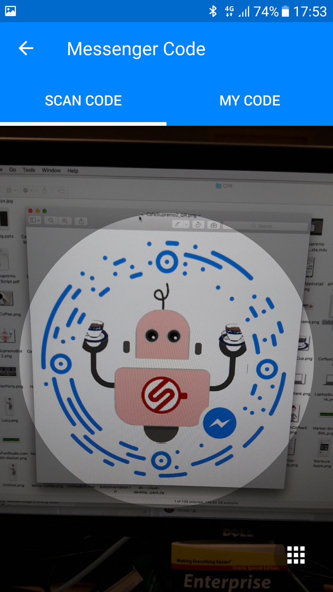

Which will open the Cafe Supremo Virtual Barsita Digital Assitant.

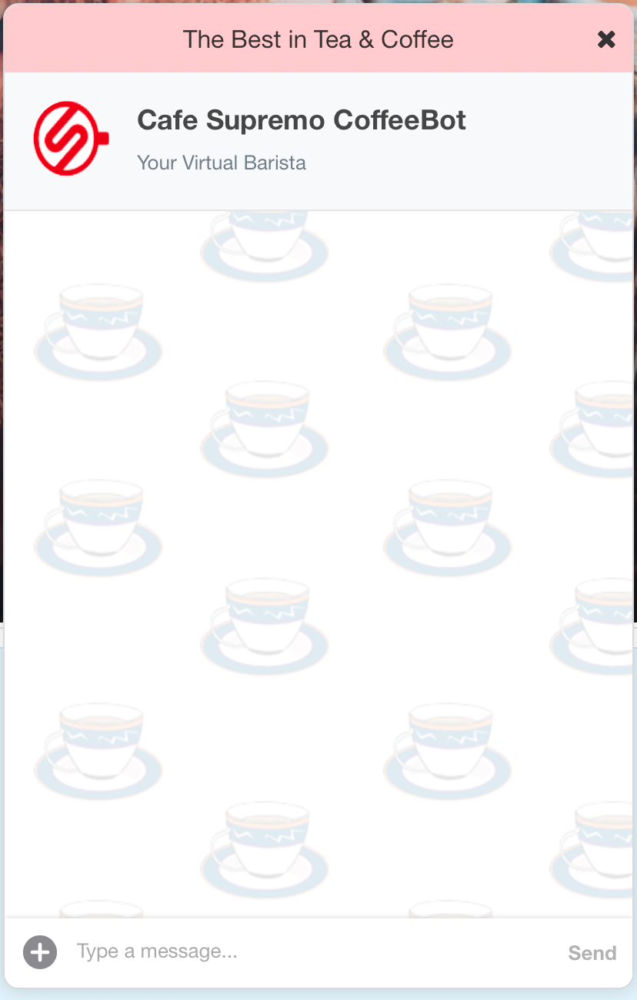

3. Try out the following interaction scenarios with the Bot. (Your input, followed by example responses by the Bot.)

=============================================

## A Brand New Customer with all Questions ##

- **``"Hello Coffeebot!"``**
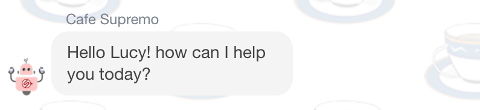

- **``"I really need a strong coffee!"``** 
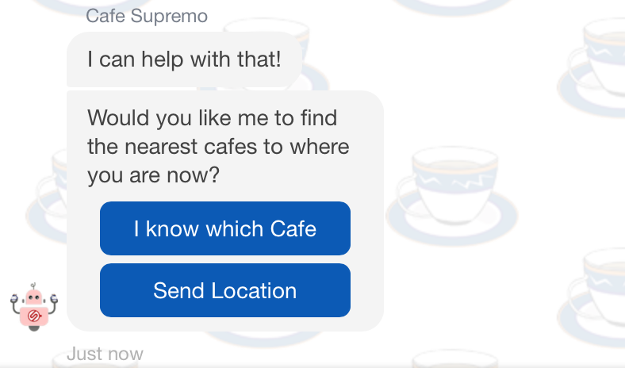

- **Select “Send Location”
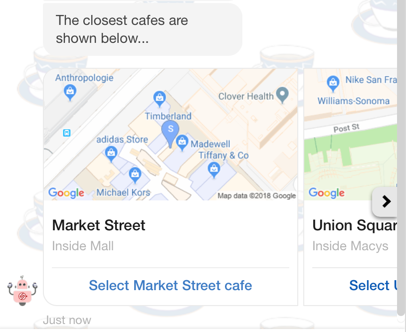

- **Using the Carousel, choose a café location** ``(e.g. Market Street or Union Square)`` **or Type in the name of the Café location** ``(e.g. "Howard Street")``
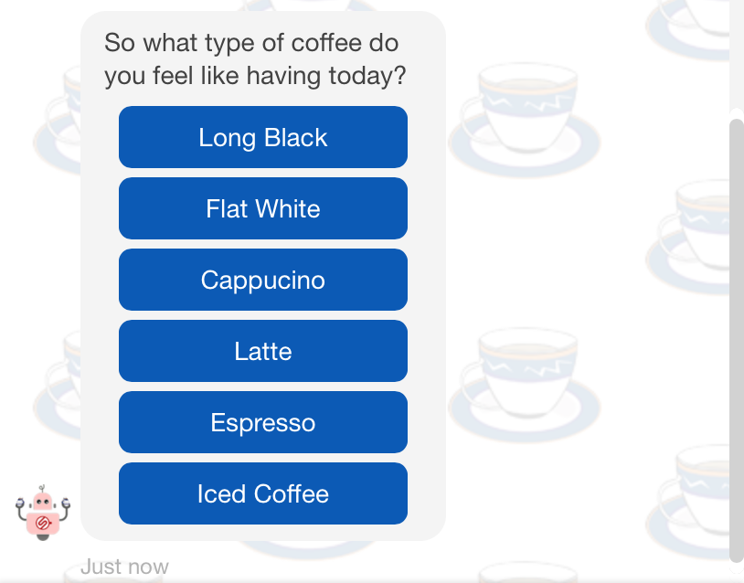

- **Choose any of the Coffee Types or type in other options**  ``(e.g. “kopiO”,”Americano”)``
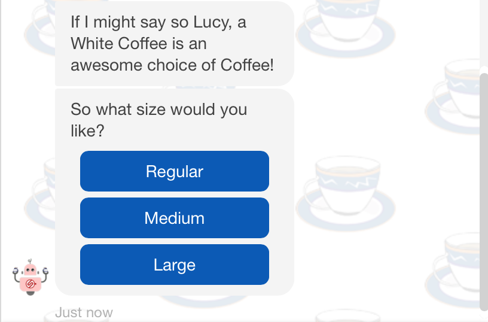

- **Coffee shops frequently have different names for their sizes.  Rather than choosing from the list try typing a “Named size”** ``(e.g. “venti”,”tall”,”grande”)``
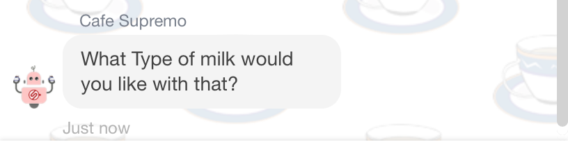

- **Type in a type of Milk : Try an an invalid Type to test the Bot ``(eg. "Fermented Yak")`` followed by a common type of Milk ``(eg. “soy”, ”skimmed”, ”regular”, ”full cream” etc.)``

**NOTE: :  If you chose a Black coffee then type something like.** ``“I said a black coffee so no Milk!” or “None”``
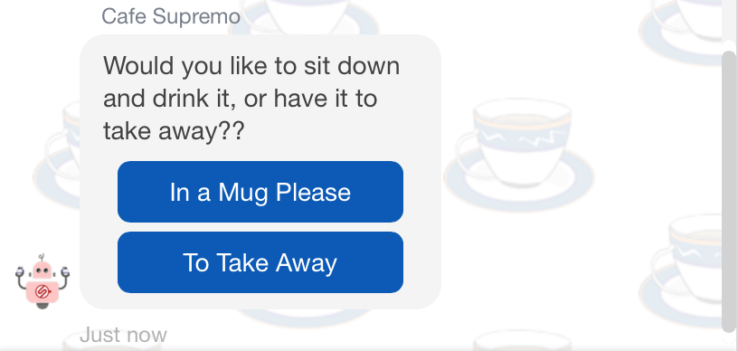

- **Choose from the list, or Type** ``“A Cup is fine”``**, or** ``“I’ll take away”``
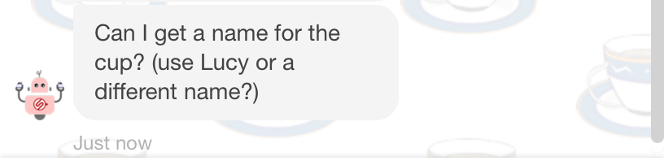

- **Write your own name or something else.**
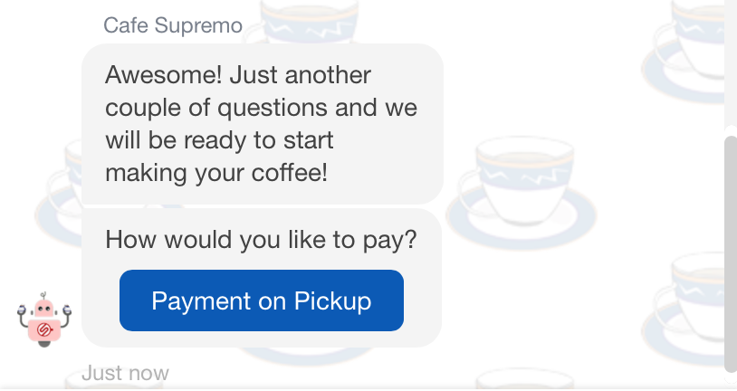

- **As Lucy is a new customer, the only option for Payment is Cash or Card at the cafe - confirm that payment method or simply type ``Cash``**
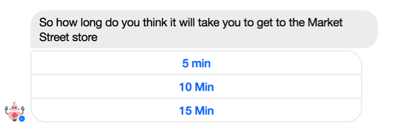

- **Choose a time period from the list or enter something like** ``“in about 10 minutes”``
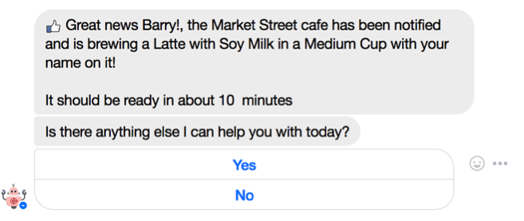

- **``"No"``**
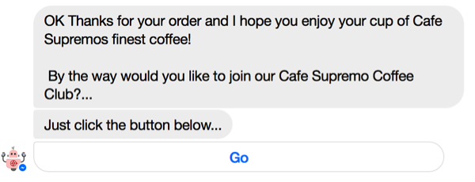

- **click the** ``[Go]`` **button, it will take you to a registration Form.**  
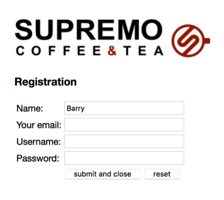

**In this case simply click the** ``[Submit and Close]`` **button to return to the Bot Conversation**.

- **``"Thank you Bot for your help!"``**
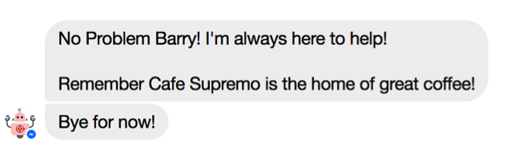

## A Repeat Customer with information from the CRM system ##
- **``"Hello Coffeebot!"``**

- **``"I want a coffee!"``** 
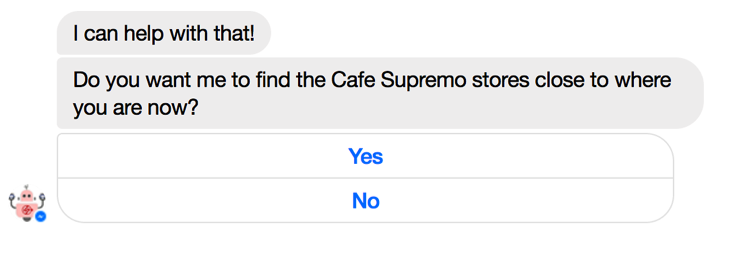

- **``"No"``**
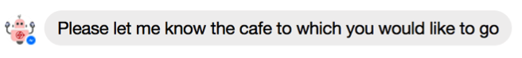

- **``"Howard Street"``**
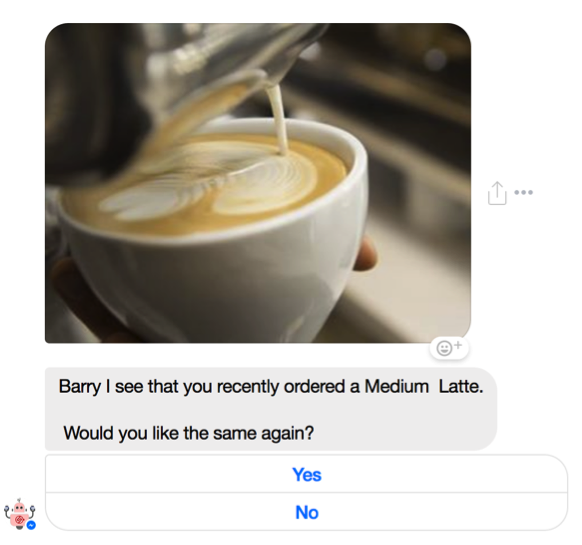

- **``"Yes"``**
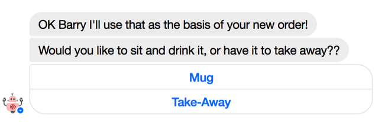

**NOTE:** The Conversation continues the same as Scenario 1,  however all questions that relate to the previous Order are skipped….

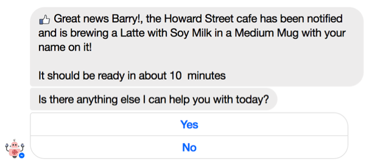

## The Customer gives sufficient information in their initial request ##
Rather than have the CoffeeBot ask a lot of questions as in Scenario #1, you can give various levels of information in the initial request/statement and the bot will avoid asking redundant questions.  (Try different versions of the initial request after the hello)

- **``"I want a large double shot soy latte to take away. I'll do a cash pick up at the Union Square cafe in about 10 Minutes"``**
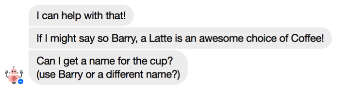

- **Write your name.**
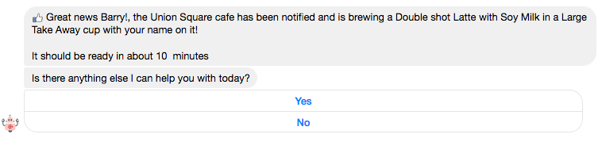

- **``"No"``**
- **``"Thanks for the help!"``**

# End of Lab 1: #

<< [Back to Intelligent Bot Test Drive Home](README.md)
