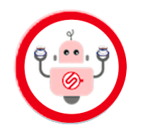

# ORACLE Cloud Test Drive #

## Lab 1: Hands On CafeSupremo Bot ##

Order a Coffee with the Café Supremo Coffee Bot. Your instructor will give you details on accessing the bot.

**NOTE:** To access the Bot you will need to have your Facebook user registered as a Tester within the Facebook App.  Please make sure you have given this to the instructor.

To find your Facebook ID (as opposed to your Login Name), login to your facebook account and click on your Avatar | name in the page header - this will take you to your profile page.

Your Facebook ID is indicated in the URL of the page ``https://www.facebook.com/{your facebook ID}``

# Lab Exercise: #

1. Open the Messenger App on your Mobile device. select the "hamburger" menu and select Scan Message Code

2. Scan the Messenger QR code given to you by your Instructor.

<< [Back to Intelligent Bot Test Drive Home](README.md)
