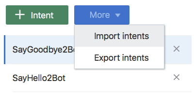
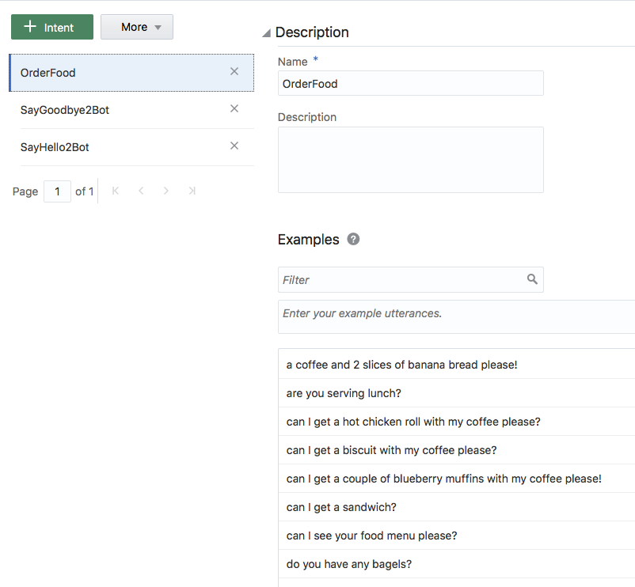
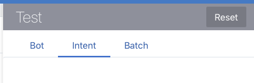
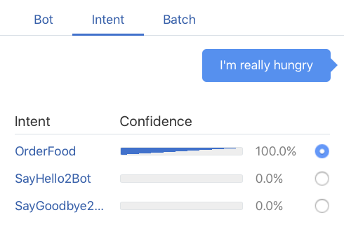
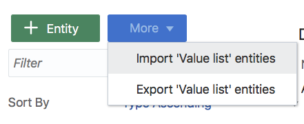
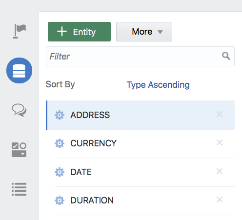
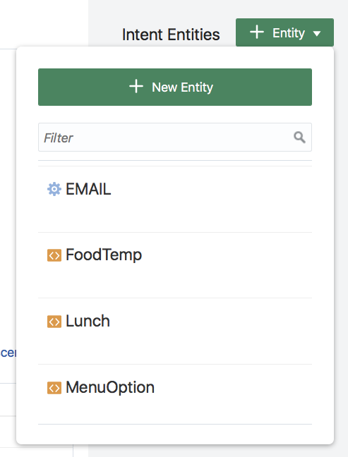
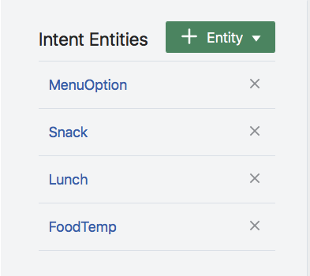
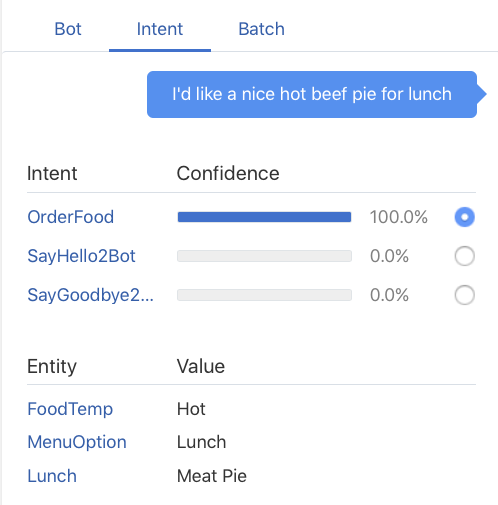
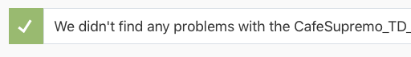

# ORACLE Cloud Test Drive #

## Lab 2: Building a Bot ##

1. Create a new Bot called ``“Café_Supremo_TD_<your Initials>`` and give it a
description **“Cafe Supremo Extension built by <your name>**

2. Click on the ``import Intents`` Button and import the Greeting intents from
the **“Intents and Entities”** folder.

3. Click the ``[More]`` button select import intents from the drop down menu.

4. Import the **“Order Food.csv”** file to load a further Intent.

5. Click the Train Button to train the engine on the supplied Utterances

6. Click the “Arrow” to launch the Bot Tester – click on the “Intent Tab”

7. Try entering some Utterances to determine what the NLP/ML had
determined is your intent.

 

8. Click the Tester Play button again to remove it.

9. Click on the Entities Icon on the left hand side tool bar ( 2nd icon down )

10. Click the [More] Button and select Import “Value List” Entities

11. Import the OrderFoodEntities.csv and YesNoEntity.csv

 

12. Manually create a new Entity by Clicking on the + Entity Button – Name
the Entity “FullMenu”

Select the “Entity List” option from the Configuration Drop down menu
and then click into the Entities field below the dropdown list.
Choose the “Lunch” and “Snack” lists to create a “super list” entity made
up of both sub lists.

13. Go back to the Intent Tab (top Icon) and select The “OrderFood” Intent
and click on the +Entity Button in the Top Right Corner.

14. Scroll down the list and select the various custom Entity Definitions
(Orange Box) to add them to the intent (associated the Entity with the
Intent gives a meaningful domain on the intent/entity for the NLP to
evaluate)

15. Restart the Tester (click the RESET button if it still shows your previous
entry).

16. Enter some Utterances to see how it has evaluated the Entities with the
defined intent.

17. Open the file OrderFoodDialog.txt file in the DialogYAML directory in a
text editor and select all the Text (cntrl-A)

18. Select the Dialog Tab in the left hand toolbar (3rd Icon)

19. Delete the Default Starter BotML (YAML) code and Paste in the contents
of the OrderFoodDialog.txt file opened previously.

20. Click the Validate Button to Confirm that the cut&paste was successful.

21. Restart the Tester and change to the “Bot” tab

22. Enter a number of Utterances to observe the flow of the Bot.

 

- “I’m really Hungry”
- I’d like something for Lunch”
- Can I have a chicken wrap
- I’d like a bite to eat
- Could really go for some real food
- Can I have a slice of Banana Bread with my coffee please?
- (Try others)

# Lab Exercise: #
<< [Back to Intelligent Bot Test Drive Home](README.md)
