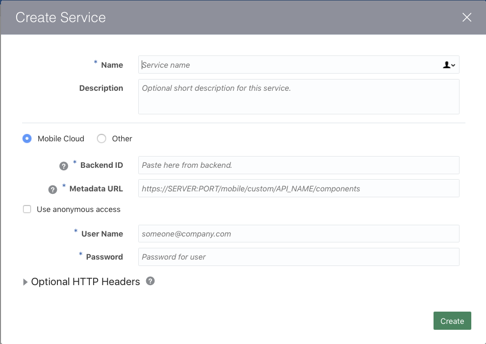

# ORACLE Cloud Test Drive #

## Lab 3: Custom Components ##

### REGISTERING CUSTOM COMPONENTS WITH THE BOT ###
<< [Back to Custom Components Introduction](300-IB.md)

1. Open to the BOT Designer (Reopen your Bot if it had been closed)

2. Click on the Component Service Icon to access the Custom Component Service Page


Click the **``[+ Service ]``** button to define a new Custom Component Service for your Bot.


3. Fill in the fields with the following details.



<table width="50%" border="0">
  <tr>
    <td>Name:</td>
    <td>CafeSupremoTD_CC</td>
  </tr>
    <tr>
    <td>Description:</td>
    <td>A Custom Component to retrieve menu Information from the Backend.</td>
  </tr>
  <tr><td colspan=2></td></tr>
  <tr>
    <td colspan=2>(*) Mobile Cloud ( ) Other</td>
  </tr>
  <tr>
    <td>Backend ID:</td>
    <td>The Backend ID you copied in Section 1 - Step 9</td>
  </tr>
  <tr>
    <td>MetaData URL:</td>
    <td>[The API BaseURL copied previously]/components   - the /GET method resource</td>
  </tr>
  <tr><td colspan=2></td></tr>
  <tr>
    <td colspan=2>[X] Use anonymous access</td>
  </tr>
  <tr>
    <td>Anonymous Key:</td>
    <td>The Anonymous Key value copied in Section 1 - Step 9</td>
  </tr>
</table>

**NOTE:** Make sure you select *``Mobile Cloud``** and *``Use Anonymous acces``** options.

Click **``[Create]``** button to register the component service.

4. Once the component service is registered, the components available for use in the dialogue flow will be displayed.  
Click on the ``getFoodMenu`` entry to see the required properties and the supported actions from the component.


5. Return to the Dialog Tab by selecting the Dialog icon.


Scroll down to find the following YAML fragment

```
# #########################################################################################
# TEST DRIVE LAB 3: Custom Component
#
# Dynamically show the Appropriate Menu, based on the selected food requirement.  
# This one component replaces the original (multiple) hard coded menu states below. 
# #########################################################################################
 
#  showMenu:
#    component: "getFoodMenuCRC"
#    properties: 
#      menuSlotVar: "menuItem"
#      menuOption: ${menu.value}
#    transitions:
#      actions:
#        Success: "getFoodHeatedOption"

#        Success: "wasSandwichChosen"
# (Replace success Action in Lab 4 => "wasSandwichChosen")
# #########################################################################################

```

This references the Custom Component you just registered and dynamically returns data from the online menu system, while also removing the need for the various additional menus (as well as introducing a different UI for the Menu).

6. Remove the **``"#"``** from the beginning of all lines between **``showMenu to Success``** inclusively.

```
# showMenu:
...
#      Success: "getFoodHeatedOption"
```

7. Run the Bot again in the “Bot Tester” to see the impact of the Custom Component.  In this case the component is generating a UI based on the Oracle Bot Common Message model, which allows for the development of sophisticated user interactions that run across Multiple Channels (but take on the look and feel of the channel).  


In Lab 5, you will learn to configure the Bot for use in external Social Channels such as Facebook Messenger


## END OF HANDS-ON ##


# Lab Exercise: #
<< [Back to Intelligent Bot Test Drive Home](README.md)
