# ORACLE Cloud Test Drive #

## Lab 4: Custom Components ##

### Intoduction ###

For a Chatbot to add value to a conversation, it must be able to return current and valid data in response to a Question.  That is, ultimately it will need to integrate into an organisation’s back end data store (the system of record) that holds the information required; such as banking information, employee information from a HR application or sales information in a Sales CRM system. 

The Oracle Intelligent Bot Platform integrates with back end data through the use of custom conversation states – known as custom components- that allow for a simple declarative reference to the data and/or process on that data (such as “getAccountBalance”). 

Via built-in integration to the Oracle Mobile Cloud, Enterprise (OMCe), the Intelligent Bots Platform uses Custom Components (CC’s) to leverage the mobile APIs defined in the MBaaS to both integrate with the systems of record and utilize mobile-first platform services, like Push Notifications to send asynchronous messages to the user.
Custom Components are exposed to the Dialog flow as REST based micro-services and while they may be developed in any language, the use of NODE.js and the associated custom component Bot JavaScript SDK is the easiest way to do so.

In this Lab Session, you will be:
 - Investigating the structure of a Node.js based Custom Component and the properties that allow it to be called from the Dialog flow. 
 - Deploying the component to the Node engine running inside the OMCe environment
 - Modifying the dialogue flow to show how easy it is to integrate the call to the Backend application into the conversation.
 - Seeing how the use of Custom components allows for the use of additional, channel specific, UI capabilities to improve the user experience (such as additional UX functions within Facebook Messenger). 


### STEP 1 CREATE THE CUSTOM COMPONENT API ###

You will be creating a custom API in MCS to act as the custom component for the Bot Dialog Flow.
To simplify this exercise we will use a **“Starter kit”** which contains a predefined component.

This Starter Pack will need to be updated with the name for the API definition you will use. 

**NOTE:** You must be consistent with the naming and use of CASE.

```<API-NAME> = “CafeSupremoTD_{YOUR INITIALS}”```

1. Rename the Starter Kit folder (this represents the node.js package)

Eg.
<table width="50%" border="0">
  <tr>
    <td align="Center">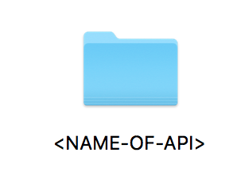</td>
    <td>Rename to =></td>
    <td align="Center">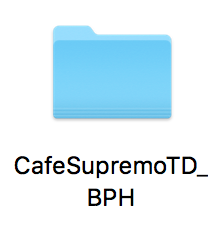</td>
  </tr>
</table>

2. Open the folder and rename the **``{NAME-OF-API}.raml``** and **``{NAME-OF-API}.js``** files in the same way .

3. Open the newly renamed RAML file and edit the name references within the file (at the top of the file)

```
#%RAML 0.8
# This RAML describes the Bots component service REST API contract.
# An MCe custom code API that implements this RAML will be a Bots
component service.
title: <NAME-OF-API>
version: 1.0
baseUri: /mobile/custom/<NAME-OF-API>
```

4. Edit the package.json file and update the API name references

```
{
"name" : "{NAME-OF-API}",
"version" : "1.0.0",
"description" : "Bots OMCe component for TD2",
"main" : "<NAME-OF-API>.js",
"repository": {},
…
```

5. Edit the renamed **``{NAME-OF-API}.js``** file and update the URI reference

```
const apiURL = '/mobile/custom/{NAME-OF-API}/components';
```

6. Login to the MCS instance as the **``TestDrive``** user (the Base URL & current password will be given to you by the facilitator)
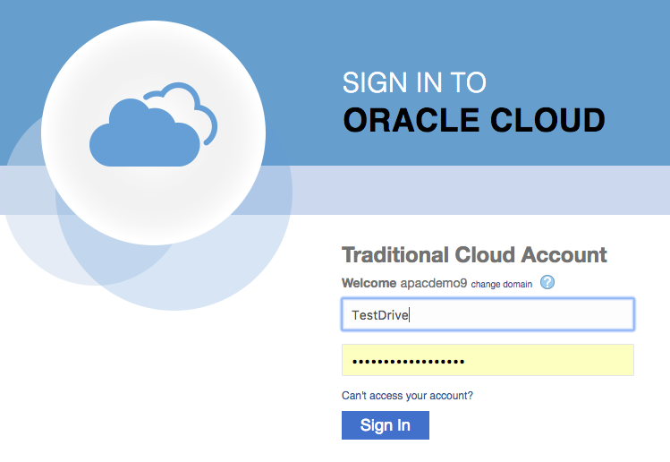

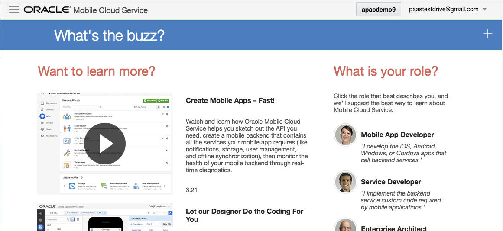

7. Click on the "Hamburger Menu" at the top of the page 
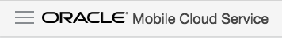

to expose the MCS Function Menu.

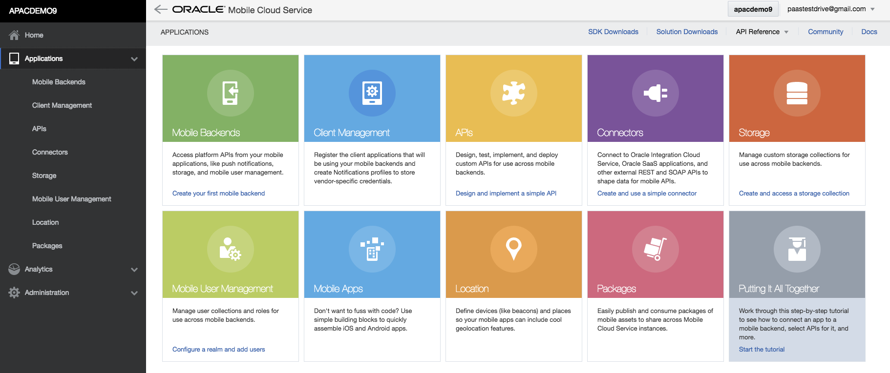

Click on the Mobile Backend Sub Menu (Under Applications).

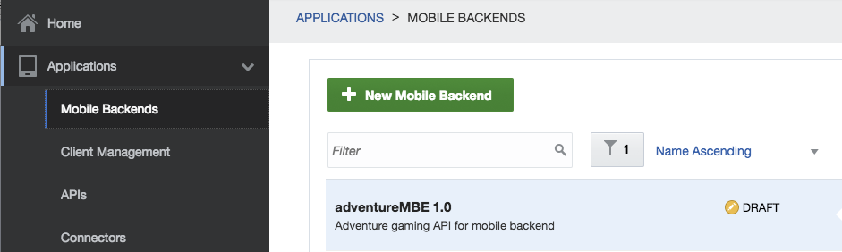

8. Click on the ``[+ New Mobile Backend]`` botton to create a new Mobile Backend. 
 - Enter the MBE Name: **``CafeSupremoTD_MBE_{Your Initials}``**.  
 - Enter a Description : "Mobile Backe end for APIs to expose backend data to Bot"

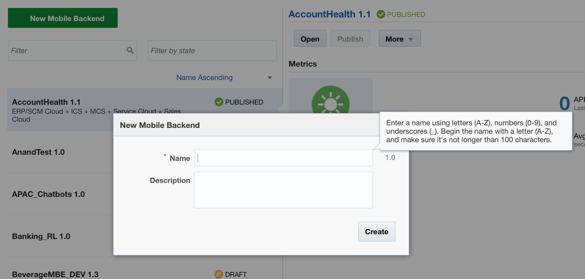

9. After the Mobile Back End (MBE) is created, Select The **``Settings``** Sub-menu under the newly created Mobile Back End.

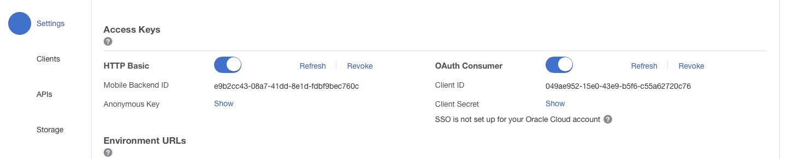

Click the **``Show``** link next to the **Anonymous Key** label to show the Public authentication Token for the MBE.

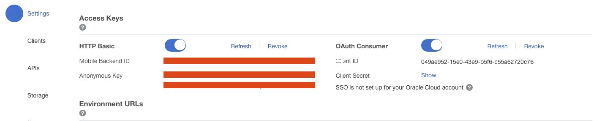

Copy the **``Mobile Backend ID``** and the **``Anonymous Key``** to a text editor for use later.

10. Click the **``APIs``** link in the main menu to show the currently defined Custom APIs page (standard API).

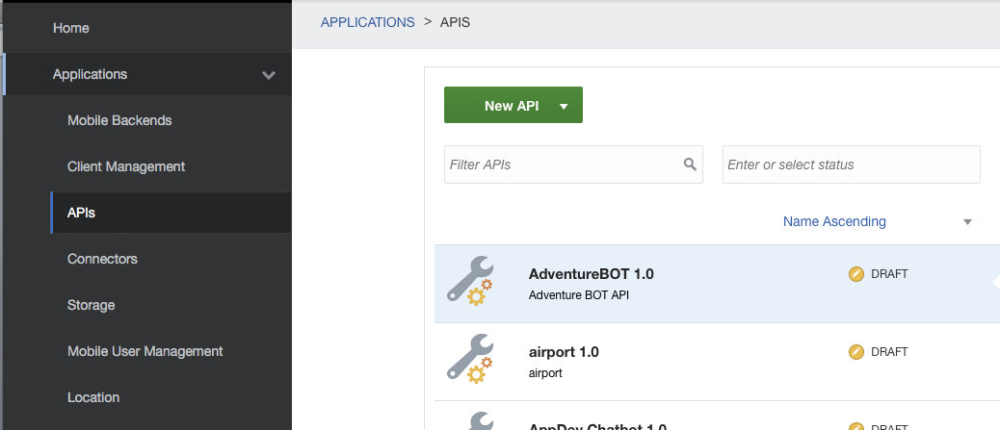

and select ``[New API]`` => ``API`` (**NOT Express API**)

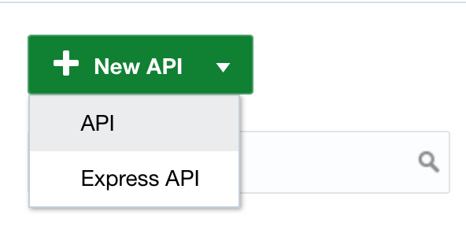

11. Drag your Renamed RAML file from the Project Folder onto the Dialog Box's Drop area to create the API
definition

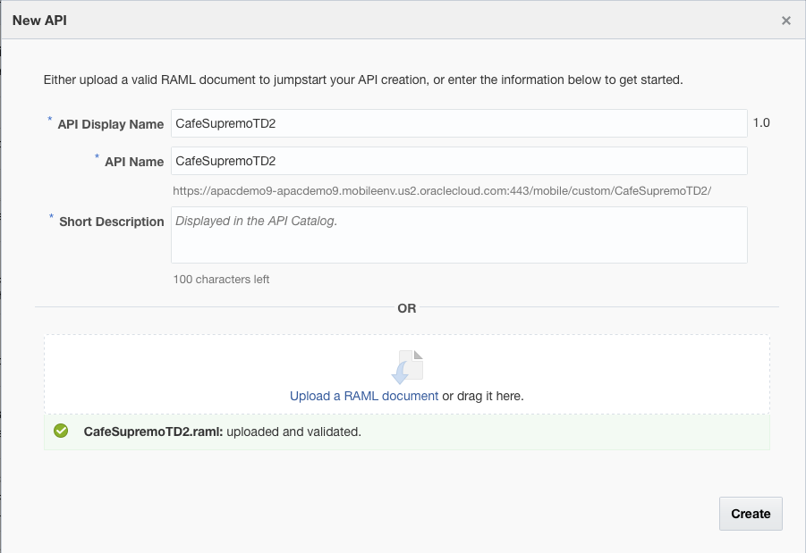

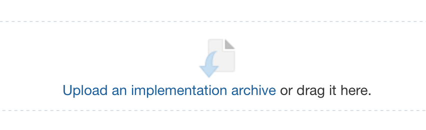

12. Once the API has been created, open the ``General`` if it is not the default (should be on this tab after creating the new API)

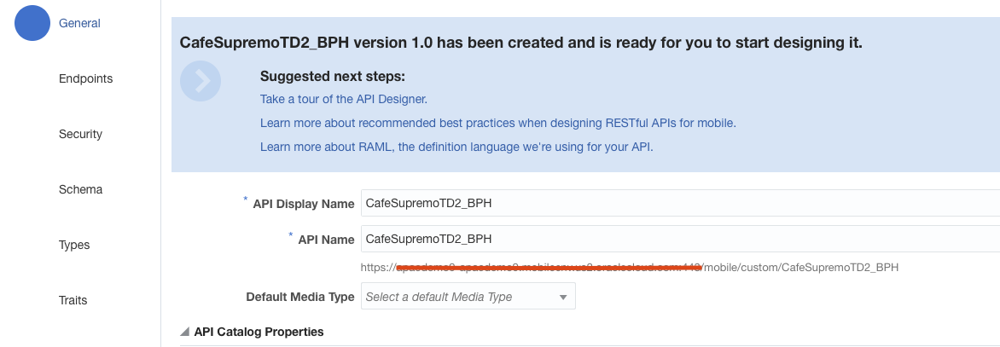

Copy the API base URL (under the API Name field) and copy it to a text Editor for future use (similar to MBE and Anonymous Key).

13. Click on the ``EndPoints`` Sub menu and confirm the confirm the creation of the following Resource Endpoints

```
/components
/components/{componentName}
```

eg.
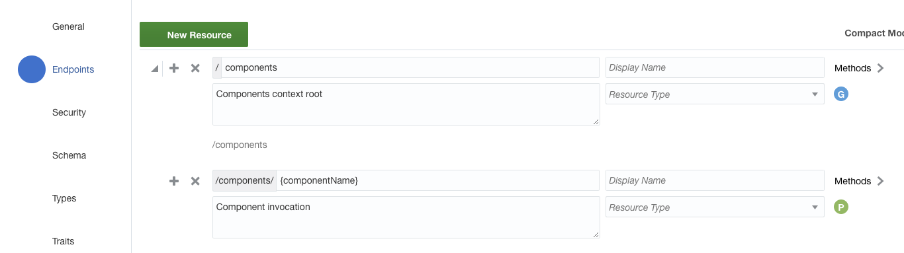

14. Change to the Security Tab and turn OFF the ``Login Required`` security option using the Toggle Switch as shown.

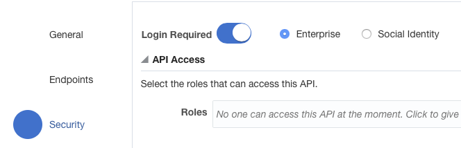

to

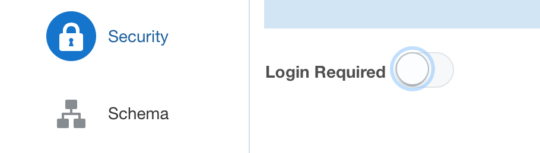


15. Now Zip up the entire package directory

Eg.
<table width="50%" border="0">
  <tr>
    <td align="Center">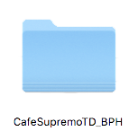</td>
    <td>COMPRESS =></td>
    <td align="Center">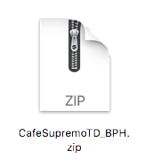</td>
  </tr>
</table>


16. Return to the Mobile Cloud Service Dashboard.  

With the API page for your API open, Change to the Implementation Tab (2nd from Bottom) 

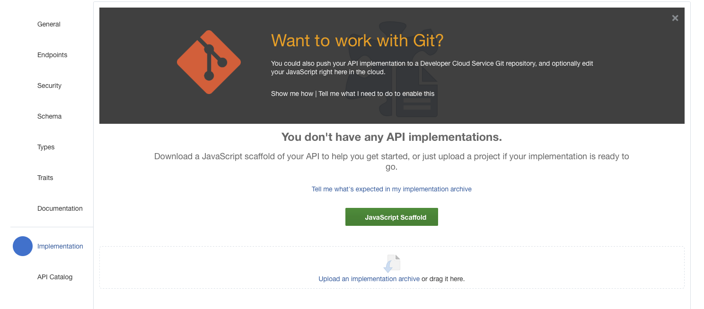


and drag the Zip file onto the “Drag-n-Drop” box to create an Runtime implementation in the embedded Node.js engine.

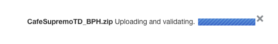

17. Confirm that the API loaded and was validated successfully.

18. Test the functionality of the Loaded API by clicking the ``[TEST]`` button (top right corner)

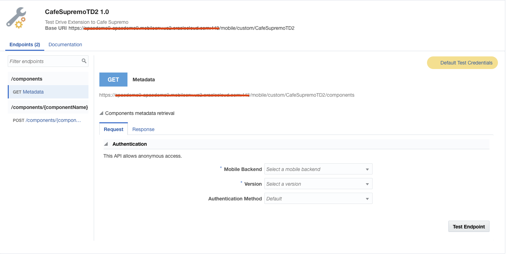

Set the Mobile Back End as the one you created in the first Step. 

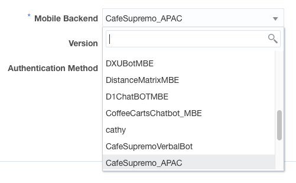

And Press ``[TEST]``

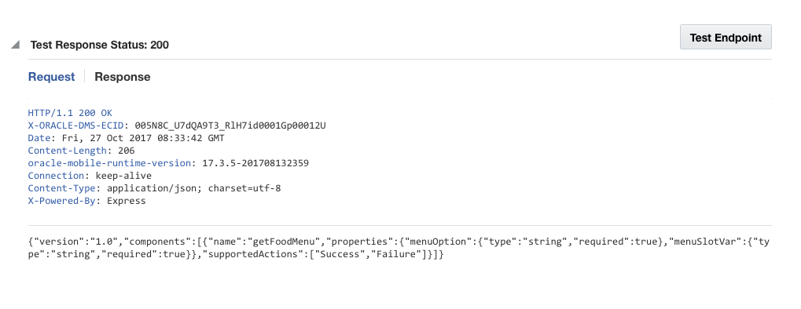

A successful call to the Service will result in a Status code of **200** as well as a JSON payload containing the metadata block describing the service.


### STEP 2 REGISTER THE CUSTOM COMPONENT WITH THE BOT ##

1. Return to the BOT Designer (Reopen your Bot if it had been closed)

2. Click on the Component Service Icon to access the Custom Component Service Page


Click the **``[+ Service ]``** button to define a new Custom Component Service for your Bot.


3. Fill in the fields with the following details.

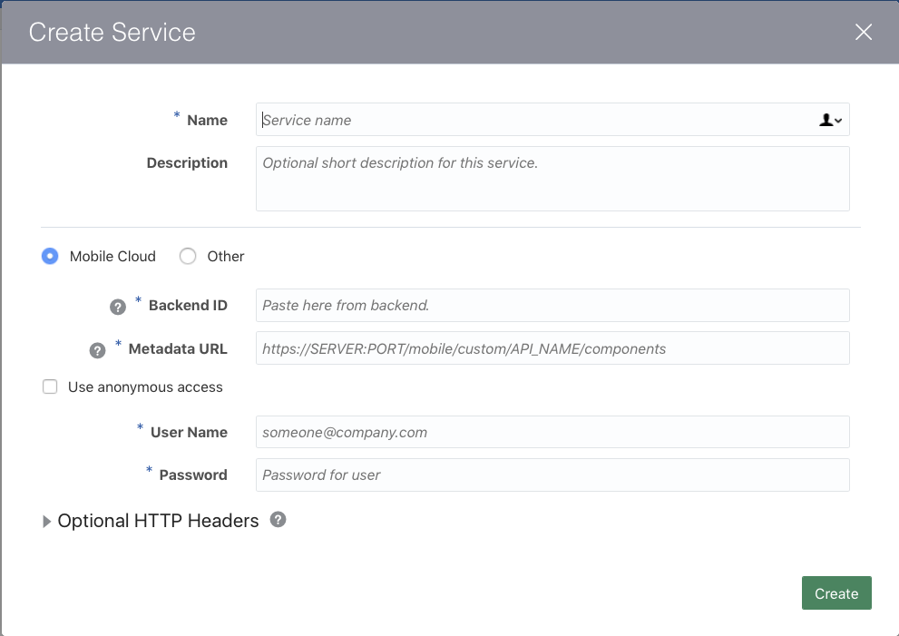
<table width="50%" border="0">
  <tr>
    <td>Name:</td>
    <td>CafeSupremoTD_CC_{YOUR INITIALS}</td>
  </tr>
    <tr>
    <td>Description:</td>
    <td>A Custom Component to retrieve menu Information from the Backend.</td>
  </tr>
  <tr colspan=2></tr>
  <tr>
    <td>(*) Mobile Cloud</td><td>( ) Other</td>
  </tr>
</table>

```
<table width="50%" border="0">
  <tr>
    <td>Name:</td>
    <td>CafeSupremoTD_CC_{YOUR INITIALS}</td>
  </tr>
    <tr>
    <td>Description:</td>
    <td>A Custom Component to retrieve menu Information from the Backend.</td>
  </tr>
  <tr colspan=2></tr>
  <tr>
    <td>(*) Mobile Cloud</td><td>( ) Other</td>
  </tr>
</table>

Name: CafeSupremoTD_CC_{YOUR INITIALS}
Description: A Custom Component to retrieve menu Information from the Backend.

(*)Mobile Cloud () Other

Backend ID: The Backend ID you copied in Section 1 - Step 9

MetaData URL:  {The API BaseURL copied previously}/components   - the /GET method resource

[X] Use anonymous access

Anonymous Key: The Anonymous Key value copied in Section 1 - Step 9

```

Make sure you select *``Mobile Cloud``** and *``Use Anonymous acces``** options.

Click **``[Create]``** button to register the component service.

4. Once the component service is registered, the components available for use in the dialogue flow will be displayed.  
Click on the ``getFoodMenu`` entry to see the required properties and the supported actions from the component.


5. Return to the Dialog Tab by selecting the Dialog icon.


Scroll down to find the following YAML fragment

```
# ======================================================
# Show the Appropriate Menu based on selection
# ======================================================
# LAB CHANGE - will be replaced with the Custom Component
#
# showMenu:
#  component: "getFoodMenu"
#  properties:
#    menuSlotVar: ${menuItem.value}
#    menuOption: ${menu.value}
#  transitions:
#    actions:
#      success: "getFoodHeatedOption"
# ==================================================
```

This references the Custom Component you just registered. This component dynamically returns data from the online menu systen removes the need for the various additional menus (as well as introducing a different UI for the Menu when the Bot is accessed in Facebook).

6. Remove the **``"#"``** from the beginning of all lines between **``showMenu => success``** inclusive.

```
# showMenu:
...
#      success: "getFoodHeatedOption"
```

7. Run the Bot in the Dashboard and again in Facebook to see the impact of adding the Custom Component.

## END OF HANDS-ON ##


# Lab Exercise: #
<< [Back to Intelligent Bot Test Drive Home](README.md)
