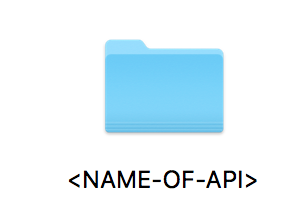
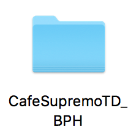

# ORACLE Cloud Test Drive #

## Lab 4: Custom Components ##

### STEP 1 CREATE THE CUSTOM COMPONENT API ###

You will be creating a custom API in MCS to act as the custom component for the Bot Dialog Flow.
To simplify this exercise we will use a **“Starter kit”** which contains a predefined component.

This Starter Pack will need to be updated with the name for the API definition you will use. 

**NOTE:** You must be consistent with the naming and use of CASE.

```<API-NAME> = “CafeSupremoTD_{YOUR INITIALS}”```

1. Rename the Starter Kit folder (this represents the node.js package)
Eg.
<table border="1">
  <tr>
    <td></td>
    <td>Rename to =></td>
    <td></td>
  </tr>
</table>


to



2. Open the folder and rename the **``{NAME-OF-API}.raml``** and **``{NAME-OF-API}.js``** files in the same way .

3. Open the newly renamed RAML file and edit the name references within
the file (at the top of the file)

```
#%RAML 0.8
# This RAML describes the Bots component service REST API contract.
# An MCe custom code API that implements this RAML will be a Bots
component service.
title: <NAME-OF-API>
version: 1.0
baseUri: /mobile/custom/<NAME-OF-API>
```

4. Edit the package.json file and update the API name references

```
{
"name" : **"{NAME-OF-API}"**,
"version" : "1.0.0",
"description" : "Bots OMCe component for TD2",
"main" : "<NAME-OF-API>.js",
"repository": {},
…
```

5. Edit the renamed ``{NAME-OF-API}.js`` file and update the URI reference

```
const apiURL = '/mobile/custom/{NAME-OF-API}/components';
```

6. Login to the MCS instance (the Base URL will be given to you by the acilitator)

7. Create a new Mobile Backend based on “_Initials” naming model.

8. Goto the API page and select New API. (standard API).

9. Drag the RAML file from the Folder onto the Dialog Box to create the API
definition

10. Once created open the API and confirm the creation of the specified End
Points

```
/components
/components/{componentName}
```

11. Change to the Security Tab and turn OFF the security for the API.

12. Now Zip up the entire package directory

13. Change to the Implementation Tab (2nd from Bottom) and drag the Zip
file onto the “Drag-n-Drop” box to create an implementation

14. Confirm that the API loaded and was validated successfully.

15. Test the /GET Method by Clicking the TEST Button (Top Right Corner)
Set the Mobile Back End as the one you created in the first Step. And Press TEST
You should get a 200 with a metadata block describing the service.

### STEP 2 REGISTER THE CUSTOM COMPONENT WITH THE BOT ##

1. Access the Custom Component Service Page in the Bot Designer.

2. Fill in the fields with the URI to the Components Resource and the Mobile
Backend ID and Anonymous Key from the Settings Page of the Mobile Back End.

Make sure you select **“Mobile Cloud”** and **“Use Anonymous access”** options.

Once it has registered it will show the Custom Components available to be
used as part of the conversation flow.

Go to the Dialog Tab and find the following YAML fragment

```
# ======================================================
# Show the Appropriate Menu based on selection
# ======================================================
# LAB CHANGE - will be replaced with the Custom Component
#
# showMenu:
#  component: "getFoodMenu"
#  properties:
#    menuSlotVar: ${menuItem.value}
#    menuOption: ${menu.value}
#  transitions:
#    actions:
#      success: "getFoodHeatedOption"
# ==================================================
```

This references the Custom Component you just registered. One
component will remove the need for the various additional menus as well
as introducing a different UI for the Menu when the Bot is accessed in
Facebook.

Run the Bot in the Dashboard and again in Facebook to see the impack of
adding the Custom Component.

## END OF HANDS-ON ##


# Lab Exercise: #
<< [Back to Intelligent Bot Test Drive Home](README.md)
