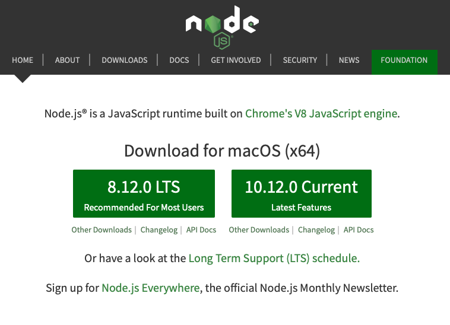

# ORACLE Cloud Test Drive #

## Lab 5 Exposing the Digital Assistant with a Web Page ##

### Introduction ###
Having built the Digital Assistant, the next step is to determine whic "Channel" will be the most appropriate to use in order to maximise access by the user community.  For a B2C environment this may dictate the use of one of the popular Social Channels (such as Facebook Messenger or WeChat), while for an employee focused environment integration with the Corporate Intranet Portal may be the best option to allow easy access to the conversational interface.  

In this lab you will be see how easy it is to integrate a chat client into a web application, via use of the JavaScript Client SDK.

### Pre-requisite ###
In order to host the web page you will deploy a simple Node.js based web server to your desktop.  This will require the instalation of the Node runtime for your operating system. While this lab should work successfully on older versions of Node, it is recommended that you upgrade to the latest stable (LTS) release for your platform.

- Goto [https://node.js.org](https://node.js.org) and download/install the current LTS release for your computer

  - **Note** The download for your OS should be the default option.

eg.

# Lab Exercise #

## Conclusion ##
 
In this Lab you:
 

## END OF HANDS-ON ##

# Lab Exercise: #
<< [Back to Digital Assistant Test Drive Home](README-IBCS.md)
