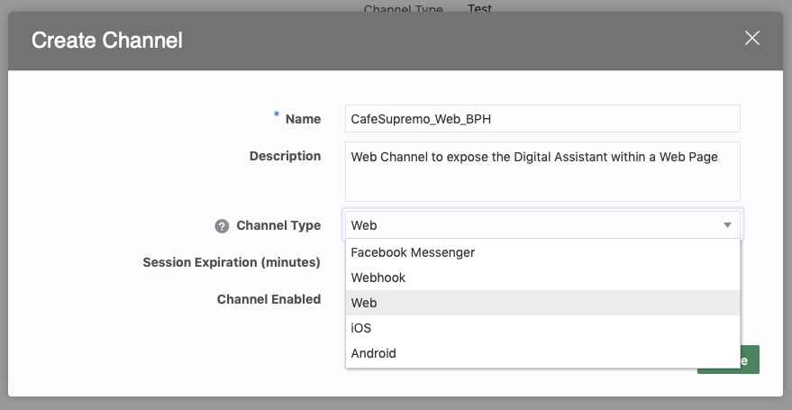

# ORACLE Cloud Test Drive #

## Lab 5 Exposing the Digital Assistant with a Web Page ##

### Introduction ###
Having built the Digital Assistant, the next step is to determine whic "Channel" will be the most appropriate to use in order to maximise access by the user community.  For a B2C environment this may dictate the use of one of the popular Social Channels (such as Facebook Messenger or WeChat), while for an employee focused environment integration with the Corporate Intranet Portal may be the best option to allow easy access to the conversational interface.  

In this lab you will be see how easy it is to integrate a chat client into a web application, via use of the JavaScript Client SDK.

### Pre-requisite ###
In order to host the web page you will deploy a simple Node.js based web server to your desktop.  This will require the instalation of the Node runtime for your operating system. While this lab should work successfully on older versions of Node, it is recommended that you upgrade to the latest stable (LTS) release for your platform.

- Goto [https://node.js.org](https://node.js.org) and download/install the current LTS release for your computer

  - **Note** The download for your OS should be the default option.

eg.

- Install the Node.js runtime and confirm that it is running successfully by executing the following command within a command Prompt/Terminal window.

`node --version`

# Lab Exercise #

## 1. Create a Web-Channel for your Digital Assistant

1. In the Digital Assistant Builder click the Settings icon in the left navigation bar, then the Channels Tab

2. Click on the `[+ Channel]` button

In the Create Channel dialog, give the channel a Name and Description

<table width="50%" border="0">
  <tr>
    <td>Name:</td>
    <td>CafeSupremo_Web_[YOUR INITIALS]</td>
  </tr>
    <tr>
    <td>Description:</td>
    <td>Web Channel to expose the Digital Assistant within a Web Page</td>
  </tr>
  <tr>
    <td>Channel Type:</td>
    <td>Web</td>
  </tr>
  <tr>
    <td>Channel Enabled:</td>
    <td>Enabled/On</td>
  </tr>
</table>

Click `[Create]`

3. Select the new channel from the list and copy the **App Id** value to a text editor for later use.

## 2. Configure the Web Application.

1. If you have not already done so, download the [Web App](Lab_Files/CTD3.0-CafeSupremo-Web.zip) to your Desktop.

2. Expand the Zip file (CTD3.0-CafeSupremo-Web).

3. Open a Command Prompt / Terminal Window and Navigate to the `CTD3.0-CafeSupremo-Web/app` folder.

4. Open the **index.html** file in a text editor (or HTML editor if you have one available) and scroll to the end of the document to find the indicated section.

`<!-- 
  =========================================================================== 
  =          Update the AppID entry in the loadBot() function               =
  =========================================================================== 
-->
  
      
  
      
  <!-- ================================================================== -->
`
 - Replace the Parameter of the **loadBot()** Function with the **AppID** that you copied in the previous section.
 
 - Save the **index.html** file.
 
 5. Change directory back to the root folder for the web application (CTD3.0-CafeSupremo-Web).  Confirm that this folder contains a package.json file.
 
 6. Making sure you are in the directory specified, run the following command:
 
 **`npm install`**
 
This will deploy the Web Application to the local Node.js Container that is installed on your computer

## Conclusion ##
 
In this Lab you:
 

## END OF HANDS-ON ##

# Lab Exercise: #
<< [Back to Digital Assistant Test Drive Home](README-IBCS.md)
