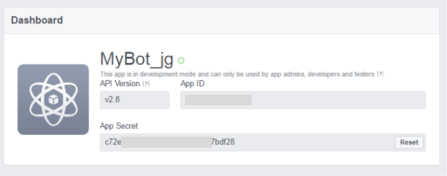

# ORACLE Cloud Test Drive #

## Lab 5 Instant Apps for Structured Data ##

### Intoduction ###

While a conversational interface is a natural metaphor for interacting with the backend data and processes, the need to input a larger amount of static data makes this mechanism a lot more cumbersome and difficult as part of a Question / Answer conversation. 

Rather than being forced to respond to multiple (often repetitive) questions, each to return the appropriate data value, it would be more efficient and intuitive to use a traditional Form Style interface to input the data in a single step.

The Oracle Intelligent Bot Platform addresses this issue through the use of “Instant Apps”; which are rich, interactive widgets that can be embedded in the conversation at the point where a more sophisticated user interface is required.

By incorporating an “Instant App” into the dialogue flow, you will be able to collect the required structured data using a Form interface, that uses standard UI elements (Text Fields, Pop-Lists, Radio Buttons, Check Boxes etc.) and after any required validation, pass it back into the dialog as a single conversation step.

In this Lab Session, you will be:

 - Reviewing the “Instant App” Builder and the available UX functionality by the cloning of two template apps:

<table width="50%" border="0">
  <tr>
    <td align="Left">
    <ul><li><B>Design My Lunch:</B></li></ul> 
    A simple Form style Interface to determine the customer’s preferences out of the many options available when ordering a Sandwich.  
    </td>
    <td align="Center"></td>
  </tr>
  <tr><td cspan="2"></td></tr>
  <tr>
    <td align="Left">
    <ul><li><B>Give Your Feedback:</B></li></ul> 
    Survey Form to allow the user to rate their experience of placing an order via the Café Supremo Coffee Bot  
    </td>
    <td align="Center"></td>
  </tr>
</table>

 - Incorporate the new "Instant Apps" into the Cafe Supremo conversation flow, through use of the System.Interactive Component, passing in relevant information from the Flow (in this case the Current User’s Name) and returning the submitted form input back into the conversation.

### Exercise Steps ###

1. Access the Oracle Mobile Cloud Bot builder UI using the following URL

http://{hostname}:8080/botsui/bot

Your instructor will give you the cloud server host name to use.

2. Click the Instant App Button in Header to open the Oracle Instant App Builder

3. The Builder has a number of mechanisms to start to build an “Instant App”

 - Starting with a “Blank Canvas”
 - Basing The Design on a Use Case template
 - Importing the Instant App Source File (JSON)
 - Cloning a previously Built Instant App

Click on the “New Instant App” Button to See the Create App Page.

4. In this case we will start by cloning a partially complete Instant App.  So return to the Main Page by either clicking the “Back Chevron” or the link at the bottom of the Create App Page.

5. Scroll Down to find the “CafeSupremo : Design My Lunch” Instant App.

6. Click the Menu Icon (Botton Right of box) and select “Edit a Copy”

7. Rename the Instant App from “Copy of CafeSupremo : Design My Lunch” to “CafeSupremo : Design My Lunch [Your Initials]”

Take Note of the Instant App ID – you will need this value to integrate with the Bot.

8.Click on Layout Tab to show the layout of the current panel (“MySandwichOptions”) and the available UI elements.

9. We want to add a dressing option to the Sandwich

Drag a Checkbox below the “ChkBox_Salad” checkbox element in the MySandwichOptions pane in the left panel of the builder.

10. Click on the new Checkbox element and update the properties as indicated.

<table width="50%" border="0">
  <tr>
    <th>Property</th>
    <th>Value</th>
  </tr>
  <tr>
    <td>Element ID</td>
    <td>ChkBox_Dressing</td>
  </tr>
  <tr>
    <td>Label</td>
    <td>Dressing</td>
  </tr>
</table>

11. Click the Style Button at the top of the Element Details.

12.	Expand the Layout Accordion to set the Width of the Checkbox (by default the size is set to 100% of the width of the Panel)

Set the width to 25%

NOTE. Setting the Element Width to 25% allows the new checkbox to be inline with the other options

13.	Click on the “MySandwichOptions” Pane header to again show the element options available.

14.	Drag a RadioButtons Element radio group beneath the “Choose_Salad_Type”  Radio Buttons Element in the “MySandwichOptions” Pane.

15.	Click on the new Radio Buttons Element in the MySandwichOptions Pane to display its Properties.

16.	Set the Element Properties as indicated.

<table width="50%" border="0">
  <tr>
    <th>Property</th>
    <th>Value</th>
  </tr>
  <tr>
    <td>Element ID</td>
    <td>Choose_Dressing_Type</td>
  </tr>
  <tr>
    <td>Label</td>
    <td>Choose Your Sauce...</td>
  </tr>
    <tr>
    <td>Initially Visible</td>
    <td>UNCHECKED</td>
  </tr>
    <tr>
    <td>Display Items Inline</td>
    <td>CHECKED</td>
  </tr>
</table>

17.	Add an additional Radio Button to the new “Choose_Dressing_Type Radio Group. By clicking on the “+ Add Radio Button” link

18. Set the Radio Button Labels and Values as indicated:

<table width="50%" border="0">
  <tr>
    <th>Radio Button</th>
    <th>Label</th>
    <th>Value</th>
  </tr>
  <tr>
    <td>1</td>
    <td>Mayo</td>
    <td>MAYO</td>
  </tr>
  <tr>
    <td>2</td>
    <td>Honey Mustard</td>
    <td>HONEY_MUSTARD</td>
  </tr>
    <tr>
    <td>3</td>
    <td>BBQ Sauce</td>
    <td>UNCHECKED</td>
  </tr>
    <tr>
    <td>Display Items Inline</td>
    <td>CHECKED</td>
  </tr>
</table>
## END OF HANDS-ON ##

# Lab Exercise: #
<< [Back to Intelligent Bot Test Drive Home](README.md)
