# Oracle Cloud Test Drive #

## Provisioning the Oracle Digital Assistant (ODA) ##

The Oracle Digital Assistant (aka ODA) is a stand-alone service for the development of AL/Machine Learning based Chatbots that utilse sophisticated Natural language Understanding algorythms and non-linear dialogue flows to create a more natural, human-like conversational interface.

**Note** As a stand-alone service the ODA it does not include the Automous Mobile Backend into which custom components may be executed.  As such please also provision the [Autonomous Mobile](AM.md) Service.

If you are looking to implement a non-metered Service with a static requests/Hour metric please use the steps for the [Autonomoous Mobile Cloud Enterprice](AMCE.md)

Once your account is activated simply follow the steps below to provision the Digital Assistant.

### Provisioning Steps ###

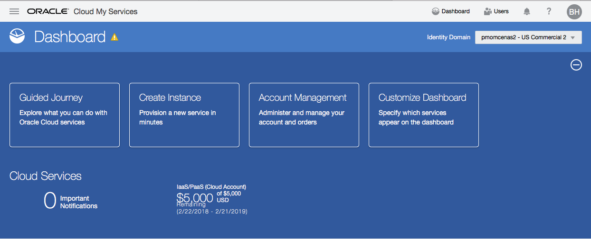

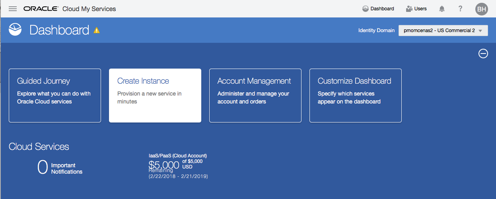

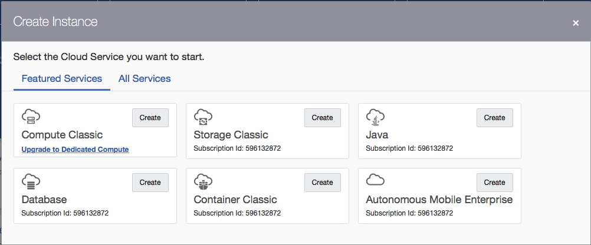

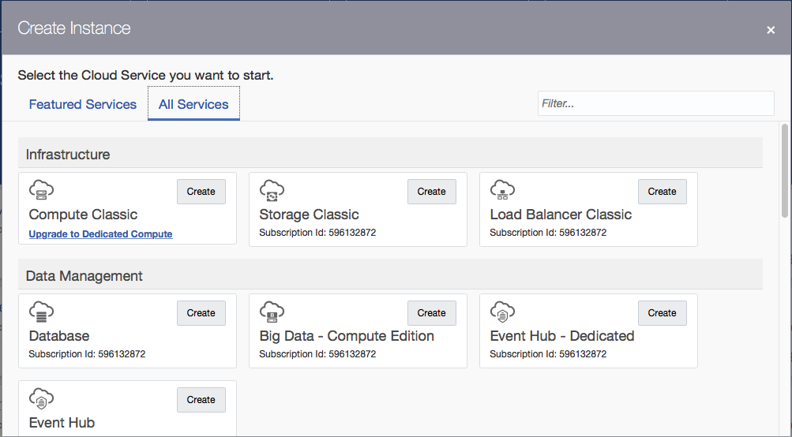

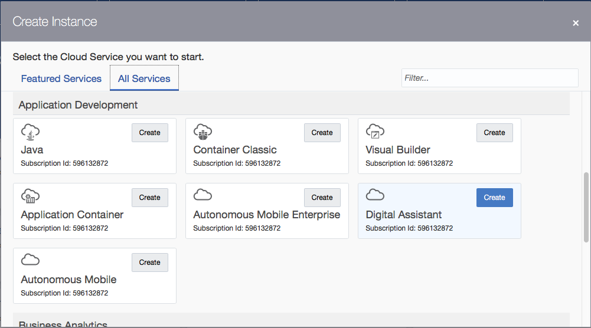

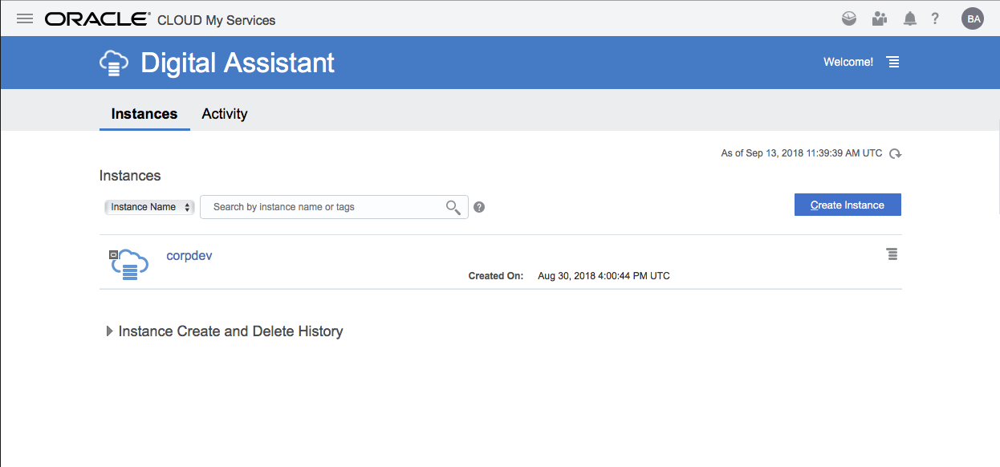

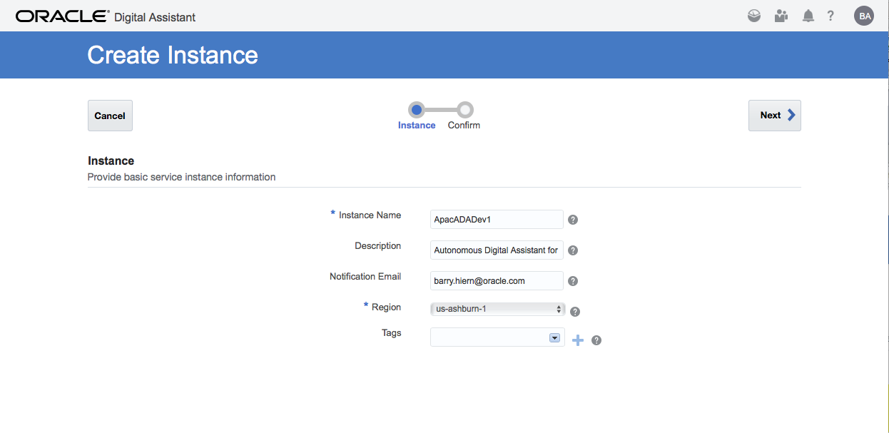

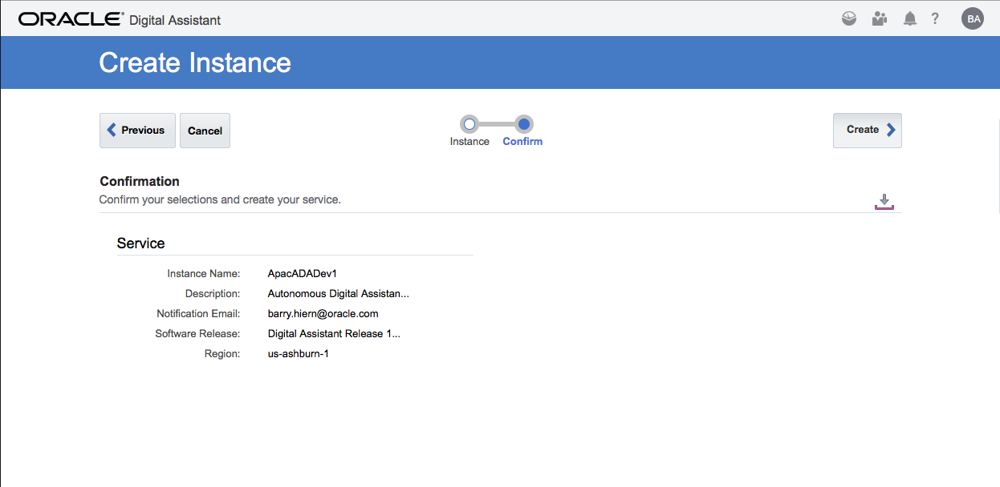

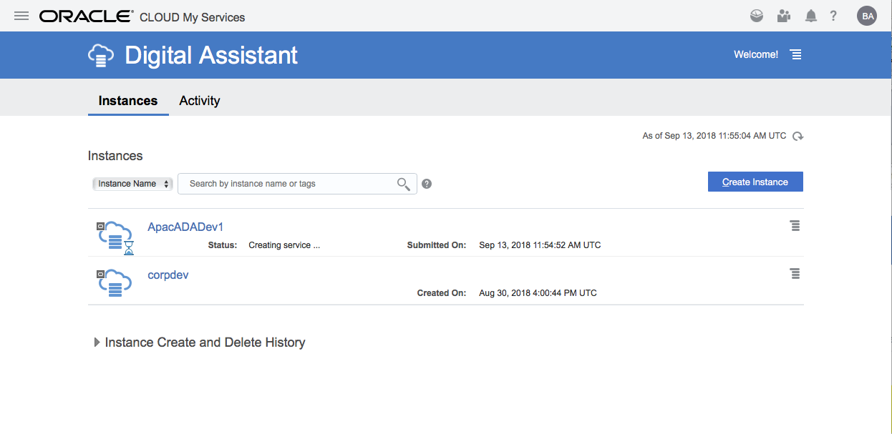

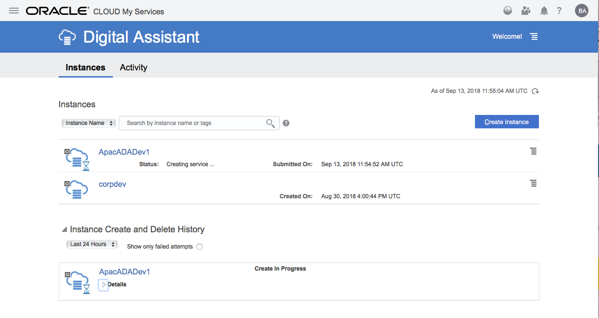

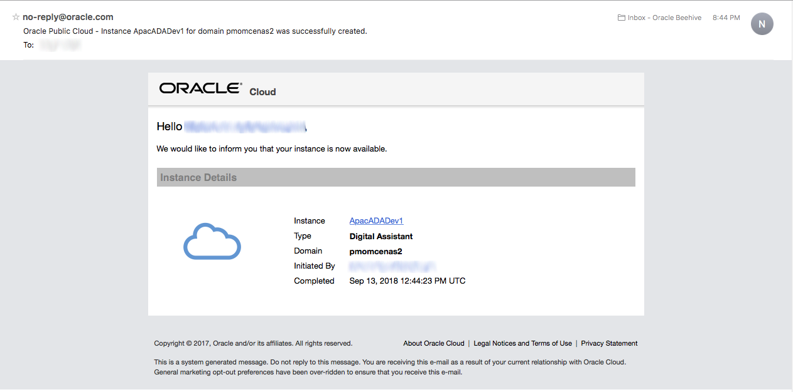

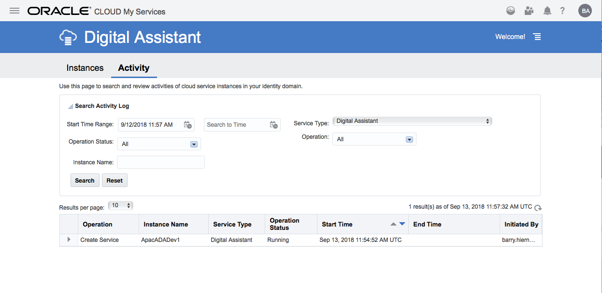

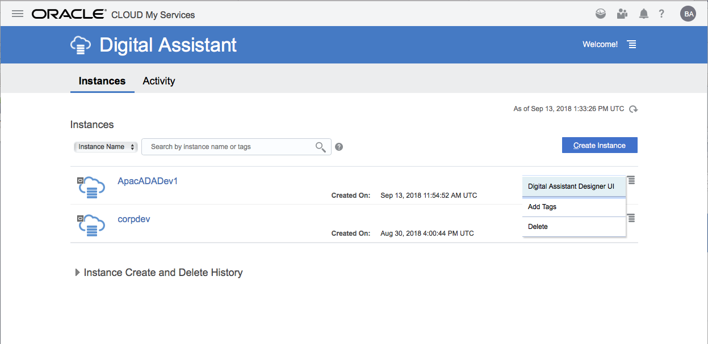

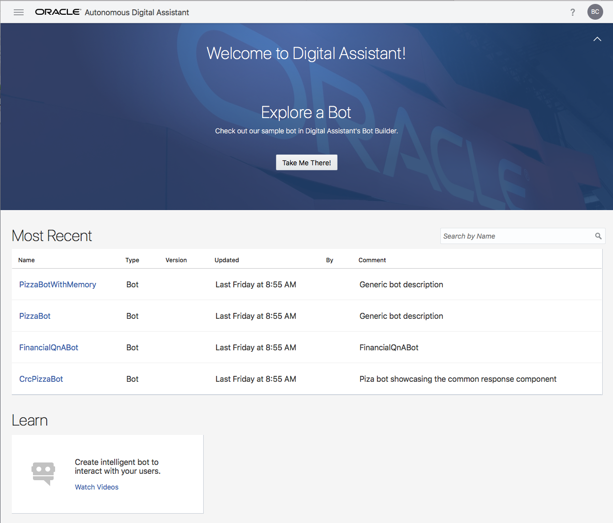

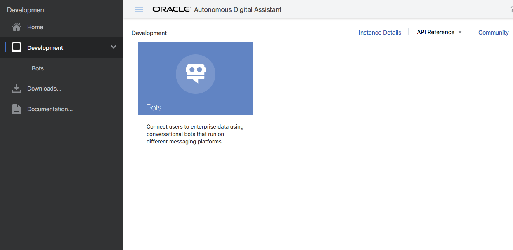

<< [Back to Autonomous Digital Assistant Test Drive Home](../README.md)