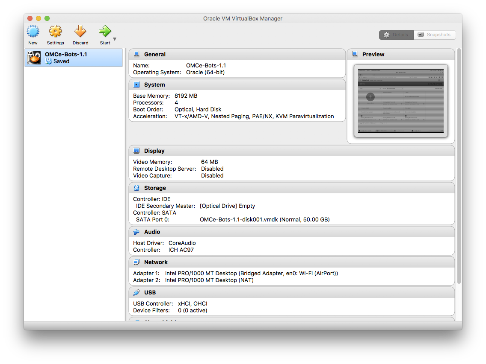
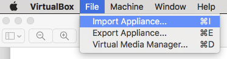

# ORACLE Cloud Test Drive #

## Appendix ##
If the hosted Oracle Intelligent bot is not available for the Workshop (or if customers wish to start developing their bots prior to their instance being available), the Oracle Intelligent Bot Platform has been made available as a small Virtual Machine image for development use.

If you wish to use the desktop image for the TestDrive 2.0 workshop, please approach your facilitator to obtain the VirtualApplicance OVA file (Open Virtual Appliance)

### Steps ###

If you do not currently have the Oracle Virtual Box virtual machine runtime installed, please download & install environment (for your operating system) from the following URL : [https://www.virtualbox.org/wiki/Downloads]

Also download the extension Pack from [http://download.virtualbox.org/virtualbox/5.2.0/Oracle_VM_VirtualBox_Extension_Pack-5.2.0-118431.vbox-extpack]

(This gives additional virtual support for USB 2.0 etc.)

1. Start Virtual Box runtime environment.

2. Import the Appliance as shown

